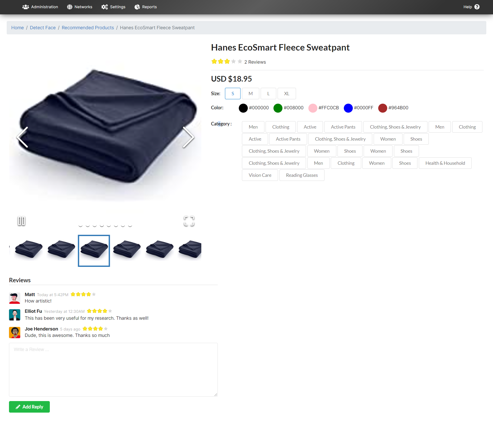
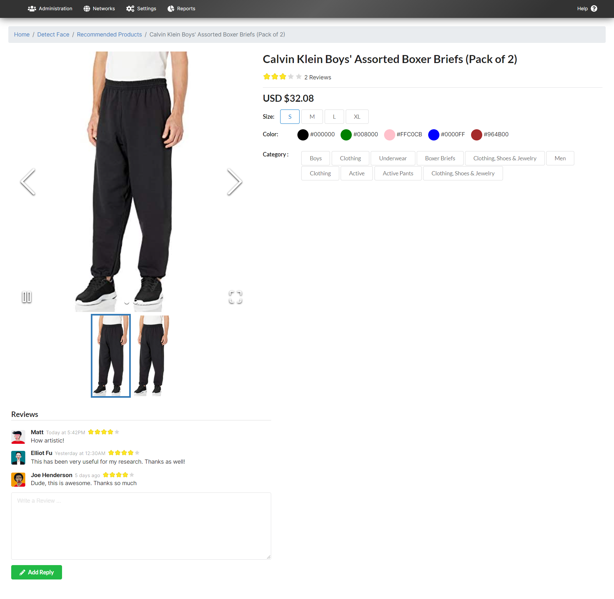

# Recognize And Recommend

A smart AI application, which can be integrated with superstores or outlets to recognize it’s customers through face and recommend relevant products.

## Introduction

Recognize and Recommend is a smart Artificial Intelligence Application which has been built on cutting edge technologies including django for backend and a demo frontend application which has been built on React.js. Purpose of the application is to recognize customers arriving in malls/outlets or superstore through their faces and recommend them products which best suit their interest. Application uses facial recognition system to Recognize customers with the help of a good cctv camera and then show the customer products on screen via collaborative filtering recommendation system.

## Methodology
Application uses a fair quality camera to detect a user's face which is then sent to the backend, we have integrated a highly efficient image detector and recognizer which initially detects a face in image and then encodes its features and saves it to a database with a name or system generated label. When the customer comes back to the store application identifies the person, with the help of recognition api.
	Our second component is the product recommendation system. When a user has been successfully identified system checks history of items purchased and user ratings on products. And with collaborative filtering, recommends the user, the products which have been rated good by other users having same interests.

### Recognition
- 

### Recommendation
- 
- 
- 

## Development Phases:
    
- ### Data Collection
    Our primary data source is amazon. We collected a dataset containing Amazon Product reviews. With the help of ids in the dataset we scrapped the Amazon website to get complete information about the products including Images, description rating price and similar product data.

- ### Data Cleaning and Categorization
    We have two primary points to use the data
    - Presenting recommended products to customers.
    - For training our model to generate recommendations.
    
    For representation we used the raw data, However for recommendation all we needed was product Ids, Customer Ids and Ratings of customer. So we dropped extra labels and used this cleaned data for our recommendation system.

- ### Face Detection and Recognition
    We have used a face detection api on the frontend which detects faces from video and sends it to the backend, on backend we have deployed separate modules for face recognition, Haar cascade and LBPH and face recognition API. We have tested and integrated both with our application, right now we are using face_recognition API because of its speed and accuracy.

- ### Product Recommendation:
    We have used collaborative filtering on products to recommend a product to a user which has received good ratings from other customers having same product buying history or purchasing interests.

## ML and DL Models
    
- ### SSD Mobilenet V1:
    The mobilenet-ssd model is a Single-Shot multibox Detection (SSD) network intended to perform object detection. This model is implemented using the Caffe* framework. We have used this model on frontend to detect face from video being captured by the camera.

- ### Haar cascade:
    Haar feature-based cascade classifiers is an effective object detection method proposed by Paul Viola and Michael Jones in their paper, “Rapid Object Detection using a Boosted Cascade of Simple Features” in 2001. It is a machine learning based approach where a cascade function is trained from a lot of positive and negative images. It is then used to detect objects in other images.
	We have used this model on the backend, after getting the image from the front we feed the image to haar cascade to generate features.

- ### LBPH:
    Local Binary Pattern (LBP) is a simple yet very efficient texture operator which labels the pixels of an image by thresholding the neighborhood of each pixel and considers the result as a binary number. 

- ### Collaborative Filtering Recommendation: 
    Collaborative filtering (CF) is the process of filtering or evaluating items through the opinions of other people. CF technology brings together the opinions of large interconnected communities on the web, supporting filtering of substantial quantities of data. We have used this recommendation model to recommend products to customers.

## Acknowledgements
This project was a Semester Project for the course "Human Computer Interaction" by "Dr Rauf Shams Malick" FALL 2020.
Built in collaboration with M.Hassan Ahmed, Noman Anjum, Ahsan Siddique.
